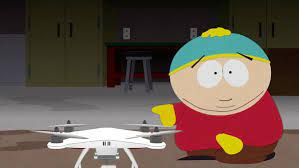

# err...wut.drone

Very early development of a testing bed for creating a customized web api for controlling a tello web drone.

----

## but why????

The idea here is to have some fun with opencv and web api's. The drone's streaming video would face capture the person.
Once the face is captured opencv would send the drone navigation signals based on where the person is positioned
inside the stream. Maintaining a center focus of the person.

I usually do these kinds of things cause I can.. and not for monetary value. However.. if you want to hire me you're
more than welcome to try.. ;)

